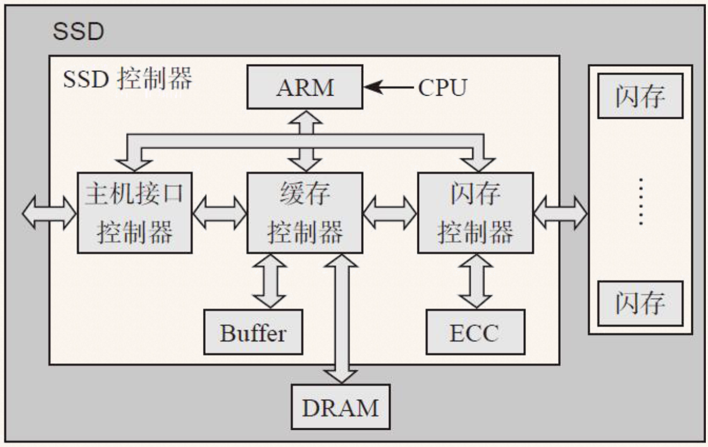

# SSD 基础知识

- [1. 延长寿命的方法](#1-延长寿命的方法)
- [2. 闪存的特性总结](#2-闪存的特性总结)
- [3. FTL](#3-ftl)
  - [3.1. 地址映射](#31-地址映射)
  - [3.2. 垃圾回收](#32-垃圾回收)
  - [3.3. 写放大](#33-写放大)
  - [3.4. 垃圾回收的实际](#34-垃圾回收的实际)
  - [3.5. Trim](#35-trim)
  - [3.6. 磨损平衡](#36-磨损平衡)
  - [3.7. 小结](#37-小结)

## 1. 延长寿命的方法

1. Wear Leveling：磨损均衡，避免少数块先挂掉，导致固态硬盘容量下降。
2. 降低写放大。降低磨损速度
3. 更好的纠错算法。容忍更高的出错率

## 2. 闪存的特性总结

1. 闪存块Block需要先擦除才能写入，不能覆盖写，即不能原地修改(Update in place)。
2. 闪存块有一定寿命，擦除次数有限。
3. 每个闪存块读的次数有限，读太多，由于读干扰（Read Disturb）会导致上面的数据出错。通常在读次数达到阈值时，将闪存块搬走。
4. 闪存的数据（Data Retention）问题。过冷的数据定期搬迁
5. 闪存天生就有坏块。FTL要进行坏块管理
6. 对于MLC和TLC来说，存在Lower Page Corruption问题
7. MLC和TLC的读写速度都不如SLC，但可以配成SLC模式来使用。

## 3. FTL

需要负责的功能包括：

1. 地址映射
2. 垃圾回收（GC）
3. 磨损均衡（Wear Leveling）
4. 坏块管理
5. 读干扰（Read Disturb）
6. 数据保持（Data Retention）

### 3.1. 地址映射

通常基于页映射，这样具有更多的随机写性能，但映射表比较大。

用户空间被划分成一个个的逻辑区域，每个区域和闪存页大小相同，**实际上，逻辑区域大小可能小于闪存页大小，一个闪存页可容纳若干个逻辑区域数据。**

用户通过LBA（Logical Block Address， 逻辑块地址）访问SSD，每个LBA代表一个逻辑块（大小一般为512B/4KB/8KB...）。而在SSD内部，SSD主控是以闪存页为基本单元读写闪存的，称为物理页（Physical Page）。**所以一个物理页可能对应若干个LBA，可以通过测试不同LBA数的随机写来判断物理页的大小。**

一张映射表多大呢，256G，4KBpage，则64M个逻辑页。若映射表的entry为4Byte，则总大小为256MB。**通常，映射表的大小为SSD容量大小的千分之一（1/1024）**。

> 映射表除了可以放在板载DRAM上，有些主控还支持放在Host内存上，称为HMB（Host Memory Buffer）。这么模式的性能介于带DRAM和不带DRAM的SSD之间。

- 带DRAM的SSD：用于缓存数据和存放映射表
- 不带DRAM的SSD：缓存数据用主控上的SRAM，映射表采用两级映射——一级映射和少量的二级映射放SRAM，大部分二级映射放在闪存上。

### 3.2. 垃圾回收

简单策略：挑选垃圾比较多的闪存块来回收。

假如SSD有4个通道（四个Die），我们需要每个通道都有一个空闲的闪存块，因此，我们做垃圾回收时，不是回收某个闪存块，而是所有通道上都要挑一个。（通常选择每个Die上块号一样的闪存块做垃圾回收）

### 3.3. 写放大

OP越大，写放大越小。

第一步，选择GC的block，最简单的策略是选择有效数据最小的Block，称为Greedy算法。另外一种是考虑擦除次数，并增加一个权重因子，这种叫BPA算法。

第二步，把有效数据读出来，如何知道哪些数据是有效的？一种是Bitmap，但是LBA很小的情况下，bitmap的数据量可能比较多，带DRAM的SSD或许可以存的下，但对于没有DRAM的SSD，这种方法不适用。因此引进**元数据**。

> SSD在把用户数据写到闪存时，会额外打包一些数据在末尾，我们称之为**元数据**。它记录着该用户数据的相关信息，如对应的逻辑地址、数据长度以及时间戳等。通常是在每个扇区末尾添加额外的数据区域，称为扩展扇区。

这样在把数据读上来以后，通过逻辑地址查询物理地址，如果物理地址一致则说明数据有效。这种方法缺点也明显，有效无效都需要读出来。另外一种这种的方法是维护L2P（logical to physical）

### 3.4. 垃圾回收的实际

1. 第一种，Foreground GC，空闲的Block数量降低到阈值时GC
2. 第二种，Background GC，在SSD空闲的时候主动GC。

### 3.5. Trim

在没有Trim之前，SSD无法知道哪些数据页被删除（是否无效），必须等到系统在相同的LBA写入数据时才知道原来的物理页无效，进而被GC。

Trim 是一个新增的ATA命令（DATA SET Management），专为SSD而生。当用户删除一个文件时，操作系统会发Trim命令给SSD，告诉SSD该文件对应的数据无效了。

> SCSI里面的同等命令叫UNMAP，NVMe里面叫Deallocate。它们指的都是同一个功能。

### 3.6. 磨损平衡

- 动态磨损平衡(dynamic WL): 把热数据写到年轻的块上。
- 静态磨损平衡(Static WL): 把冷数据写到年老的块上。

静态磨损平衡主要是防止冷数据所在的块一值不更新，而其他块随着不断更新擦除次数不断上升。该算法一般使用GC机制来做，即挑选块时，除了考虑block的垃圾量外，还要考虑冷热程度。（但要注意冷数据和热数据分别写到不同的block）

> 冷：更新频率低，热：更新频繁

### 3.7. 小结

可见SSD的主控需要包含繁多的功能，以简化用户的使用方式，或者说让SSD更加通用。

但对于一些企业，它们的应用场景不同，需要一些专用的SSD，因此自研/衍生出各种新型的SSD。

只能说太复杂了。
