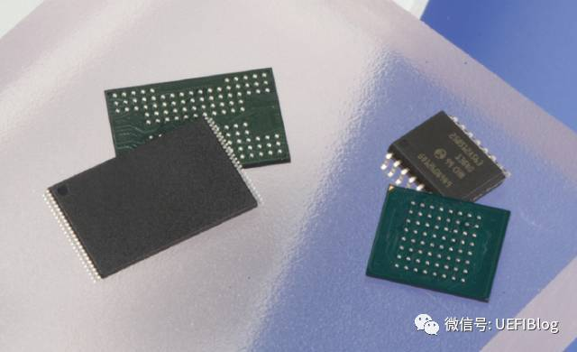
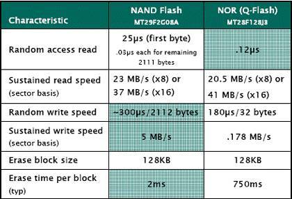
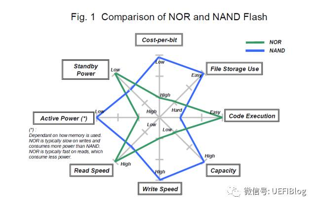
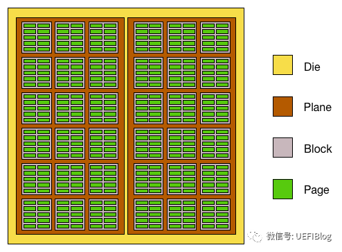
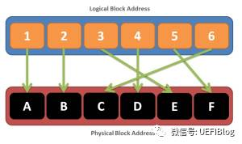

# SSD

- [1. Flash 的分类](#1-flash-的分类)
  - [1.1. 背景](#11-背景)
  - [1.2. 异同点](#12-异同点)
  - [1.3. 应用场景](#13-应用场景)
- [2. NAND Flash介质发展](#2-nand-flash介质发展)
- [3. 特性](#3-特性)
- [4. NAND SSD 结构(固件 FW)](#4-nand-ssd-结构固件-fw)
  - [4.1. 映射表](#41-映射表)
  - [4.2. 垃圾收集](#42-垃圾收集)
  - [4.3. 磨损均衡](#43-磨损均衡)
  - [4.4. 写复制](#44-写复制)
  - [4.5. Over Provisioning 过度配置](#45-over-provisioning-过度配置)
  - [4.6. 断电保护](#46-断电保护)
  - [4.7. SSD的E估值标准](#47-ssd的e估值标准)
  - [4.8. 写放大](#48-写放大)
  - [4.9. 其他](#49-其他)
- [5. 参考](#5-参考)

主要概念

- SSD Firmware(固件，FW)：Mapping Table、Garbage Collection、Wear Leveling (WL) 等
- 相关概念：Write Application、Over Provisioning、Flash Life（Program/Erase Count，P/E）
- 断电保护机制
- SSD评价标准：稳定性（主要指擦除、GC）、性能、寿命

## 1. Flash 的分类

<https://zhuanlan.zhihu.com/p/26745577>
<https://zhuanlan.zhihu.com/p/344174968>

### 1.1. 背景

intel很早发明的EPROM，这是一种可以用紫外线擦除的存储器。升级版EEPROM是电可擦除，不需要紫外线帮忙，但是读取和擦除速度却非常缓慢。于是后面出现了Flash，Flash是一种存储芯片，全名叫Flash EEPROM Memory，通过程序可以修改数据，即平时所说的“闪存”。

> 由于新发明的这种EEPROM擦除速度飞快，取名Flash

Flash 又分为 NAND flash 和 NOR flash 二种。

（左边是NAND,右边是NOR）

### 1.2. 异同点

共性：

1. 都是**非易失存储介质**。即掉电都不会丢失内容。
2. **写入前都需要擦除**，擦除再编程。（实际上NOR Flash的一个bit可以从1变成0，而要从0变1就要擦除整块。NAND flash都需要擦除。）

区别

| 属性 |NOR  | NAND |
| -- | -- | -- |
| 容量 | 较小 | 较大 |
| XIP(可执行code) | 可以 | 不行 |
| 访问方式 | 可随机访问（字节） | 块方式 |
| 读取速度 | 很快 | 快 |
| 写入速度 | 慢 | 快 |
| 可擦除次数 | 1万-10万 | 10 万-100万 |
| 块擦除速度 | 慢（约750ms）| 快（约2ms）|
| 可靠性 | 高 | 较低 |
| 价格 | 高 | 低 |

如果以美光（Micron）自己的NAND和NOR对比的话，详细速度数据如下：

如果用现在流行的关系图看是这样：

（数据来源Toshiba）

NOR的待机功率低、活动功率高、读快、写慢（包括擦除）、容量低、价格高。

**1. 擦除上(NAND擦除块更小，速度更快)**

NAND器件执行擦除操作是十分简单的，而NOR则要求在进行擦除前先要将目标块内所有的位都写为0。由于擦除NOR器件时是以64～128KB的块进行的，执行一个写入/擦除操作的时间为5s，与此相反，擦除NAND器件是以8～32KB的块进行的，执行相同的操作最多只需要4ms。

**2. 接口/访问模式上（NOR带有类似SRAM接口，可字节访问）**

NOR flash带有SRAM接口，有足够的地址引脚来寻址，可以很容易地存取其内部的每一个字节。

NAND器件使用复杂的**I/O口来串行**地存取数据，各个产品或厂商的方法可能各不相同。NAND读和写操作采用512字节的块，这一点有点像硬盘管理此类操作，很自然地，基于NAND的存储器就可以取代硬盘或其他块设备。

**3. 容量成本上（NAND尺寸小，便宜）**

NAND flash的单元尺寸几乎是NOR器件的一半，由于生产过程更为简单，NAND结构可以在给定的模具尺寸内提供更高的容量，也就相应地降低了价格。

> NOR flash占据了容量为1～16MB闪存市场的大部分，而NAND flash只是用在8～128MB的产品当中，这也说明NOR主要应用在代码存储介质中，NAND适合于数据存储，NAND在CompactFlash、Secure Digital、PC Cards和MMC存储卡市场上所占份额最大。

**4. 可靠性和耐用性上**

可以从**寿命(耐用性)、位反转和坏块处理**三个方面来比较NOR和NAND的可靠性。

NAND可擦除次数更高、擦除块、而且块大小更小（擦除次数更少）。但可靠性更低。

在NAND闪存中每个块的最大擦写次数是一百万次，而NOR的擦写次数是十万次。NAND存储器除了具有10比1的块擦除周期优势，典型的NAND块尺寸要比NOR器件小8倍，每个NAND存储器块在给定的时间内的删除次数要少一些。

所有flash器件都受**位反转**现象的困扰。在某些情况下(很少见，NAND发生的次数要比NOR多)，一个比特位会发生反转或被报告反转了。一位的变化可能不很明显，但是如果发生在一个关键文件上，这个小小的故障可能导致系统停机。如果只是报告有问题，多读几次就可能解决了。当然，如果这个位真的改变了，就必须采用**错误探测/错误更正(EDC/ECC)算法**。位反转的问题更多见于NAND闪存，NAND的供应商建议使用NAND闪存的时候，同时使用EDC/ECC算法。这个问题对于用NAND存储多媒体信息时倒不是致命的。当然，如果用本地存储设备来存储操作系统、配置文件或其他敏感信息时，必须使用EDC/ECC系统以确保可靠性。

**坏块处理**。NAND器件中的坏块是随机分布的。以前也曾有过消除坏块的努力，但发现成品率太低，代价太高，根本不划算。NAND器件需要对介质进行初始化扫描以发现坏块，并将坏块标记为不可用。在已制成的器件中，如果通过可靠的方法不能进行这项处理，将导致高故障率

**5. 使用上（NAND使用复杂，需要驱动程序）**

可以非常直接地使用基于NOR的闪存，可以像其他存储器那样连接，并可以在上面直接运行代码。

由于需要I/O接口，NAND要复杂得多。各种NAND器件的存取方法因厂家而异。在使用NAND器件时，必须先写入**驱动程序**，才能继续执行其他操作。向NAND器件写入信息需要相当的技巧，因为设计师绝不能向坏块写入，这就意味着**在NAND器件上自始至终都必须进行虚拟映射**。

> 在NOR器件上运行代码不需要任何的软件支持，在NAND器件上进行同样操作时，通常需要驱动程序，也就是内存技术驱动程序(MTD)，NAND和NOR器件在进行写入和擦除操作时都需要MTD。
>
> 使用NOR器件时所需要的MTD要相对少一些，许多厂商都提供用于NOR器件的更高级软件，这其中包括M-System的TrueFFS驱动，该驱动被Wind River System、Microsoft、QNX Software System、Symbian和Intel等厂商所采用。
驱动还用于对DiskOnChip产品进行仿真和**NAND闪存的管理，包括纠错、坏块处理和损耗平衡**。

### 1.3. 应用场景

在PC和手机上我们都可以找到NOR和NAND Flash的身影。

大多数情况下闪存只是用来**存储少量的代码**，这时NOR闪存更适合一些。而NAND则是**高数据存储密度**的理想解决方案。

> NOR Flash 的读取和我们常见的 SDRAM 的读取是类似，用户可以直接运行装载在 NOR FLASH 里面的代码，这样可以减少 SRAM 的容量从而节约成本;**应用程序可以直接在flash 闪存内运行，不必再把代码读到系统RAM中**。NOR的传输效率很高，在1～4MB的小容量时具有很高的成本效益，但是其很低的写入和擦除速度大大影响了它的性能。
>
> Nand-flash存储器具有**容量较大，改写速度快**等优点，适用于大量数据的存储，因而在业界得到了越来越广泛的应用，如嵌入式产品中包括数码相机、MP3随身听记忆卡、体积小巧的U盘等
>
> NAND Flash广泛应用在各种存储卡，U盘，SSD，eMMC等等大容量

NOR Flash和普通的内存比较像的一点是他们都可以支持随机访问，这使它也具有支持XIP（eXecute In Place）的特性，可以像普通ROM一样执行程序。这点让它成为BIOS等开机就要执行的代码的绝佳载体。**现在几乎所有的BIOS和一些机顶盒上都是使用NOR Flash，它的大小一般在1MB到32MB之间，价格昂贵**。

下面主要介绍基于 NAND Flash 的 SSD

## 2. NAND Flash介质发展

目前NVMe SSD主流采用的存储介质是NAND Flash。最近几年NAND Flash技术快速发展，主要发展的思路有两条：第一，通过**3D堆叠的方式增加NAND Flash的存储密度**；第二，**通过增加单Cell比特数来提升NAND Flash的存储密度**。**3D NAND Flash已经成为SSD标配**，目前主流发布的SSD都会采用3D NAND Flash技术工艺。从cell的角度来看，目前单个cell可以表示3bit，这就是通常所说的TLC NAND Flash。今年单个cell的bit存储密度又提升了33%，可以表示4bit，向前演进至QLC NAND Flash。NAND Flash的不断演进，推动了SSD存储密度不断提升。截止到今天，单个3.5寸SSD盘可以做到128TB的容量，远远超过了磁盘的容量。下图是近几年NAND Flash技术的发展、演进过程。

和磁盘相比，NVMe SSD最大的变化在于存储介质发生了变化。目前NVMe SSD普遍采用3D NAND Flash作为存储介质。**NAND Flash内部有多个存储阵列单元构成，采用floating gate或者charge trap的方式存储电荷，通过存储电荷的多少来保持数据存储状态。由于电容效应的存在、磨损老化、操作电压干扰等问题的影响，NAND Flash天生会存在漏电问题（电荷泄漏），从而导致存储数据发生变化**。因此，从本质上讲，NAND Flash是一种不可靠介质，非常容易出现Bit翻转问题。SSD通过控制器和固件程序将这种不可靠的NAND Flash变成了可靠的数据存储介质。

为了在这种不可靠介质上构建可靠存储，SSD内部做了大量工作。在硬件层面，需要通过ECC单元解决经常出现的比特翻转问题。每次数据存储的时候，硬件单元需要为存储的数据计算ECC校验码；在数据读取的时候，硬件单元会根据校验码恢复被破坏的bit数据。ECC硬件单元集成在SSD控制器内部，代表了SSD控制器的能力。在MLC存储时代，BCH编解码技术可以解决问题，4KB数据中存在100bit翻转时可以纠正错误；在TLC存储时代，bit错误率大为提升，需要采用更高纠错能力的LDPC编解码技术，在4KB出现550bit翻转时，LDPC硬解码仍然可以恢复数据。下图对比了LDPC硬解码、BCH以及LDPC软解码之间的能力， 从对比结果可以看出，LDPC软解码具有更强的纠错能力，通常使用在硬解码失效的情况下。LDPC软解码的不足之处在于增加了IO的延迟。

一块普通NVMe SSD的物理硬件结构简单，由大量的NAND Flash构成，这些NAND Flash通过SOC（SSD控制器）进行控制，FTL软件运行在SOC内部，并通过多队列的PCIe总线与主机进行对接。**为了提升性能，企业级SSD需要板载DRAM，DRAM资源一方面可以用来缓存数据，提升写性能**；另一方面用来**缓存FTL映射表**。企业级SSD为了提升性能，通常采用Flat mapping的方式，需要占据较多的内存（0.1%）。内存容量的问题也限制了大容量NVMe SSD的发展，为了解决内存问题，目前一种可行的方法是增大sector size。**标准NVMe SSD的sector size为4KB**，为了进一步增大NVMe SSD的容量，有些厂商已经开始采用16KB的sector size。**16KB Sector size的普及应用**，会加速大容量NVMe SSD的推广。

## 3. 特性

1. **可靠性**。SSD 抗震能力远高于 HHD

2. **大容量**：

根据每个存储单元内存储比特个数的不同，可以分为 SLC（Single-Level Cell）、MLC（Multi-Level Cell） 和 TLC（Triple-Level Cell） 三类。其中，在一个存储单元中，SLC 可以存储 1 个比特，MLC 可以存储 2 个比特，TLC 则可以存储 3 个比特。

**NAND Flash 的单个存储单元存储的比特位越多，读写性能会越差，寿命也越短，但是成本会更低**。

现在高端SSD会选取MLC甚至SLC，低端SSD则选取TLC。SD卡一般选取TLC。

3. 延迟上读慢写快（写到buffer即可）
4. 擦除写（先擦除在编程）
5. 写入尾延迟比平均延迟高两个数量级（由于磨损均衡、垃圾回收）
6. 4KB的随机访问和顺序访问性能接近。因为SSD内部会将逻辑块映射为物理块，顺序的概念已经被模糊
7. 类似NVM，小数据的随机读还是比顺序读慢
8. （NVMe）4kb，读延迟在100us左右，写延迟60us左右，但不同的SSD延迟表现差异很大

## 4. NAND SSD 结构(固件 FW)

<https://zhuanlan.zhihu.com/p/26944064>

固态硬盘（Solid State Disk）用固态电子存储芯片阵列而制成的硬盘，由控制单元和存储单元（FLASH芯片、DRAM芯片）组成。**一块SSD，核心部件是一颗控制器和多颗Flash颗粒，一般还会有一些内存和超级电容**。

-->控制器主要作用是提供高效的手段来访问这些Flash颗粒。
-->内存的作用主要是**表项管理**和读写CACHE。
-->超级电容的作用是在异常下电时保证关键数据不丢失。

而Flash颗粒是SSD最重要的器件，其相关特性决定了SSD的实现方式。几乎所有的应用NAND Flash的设备都必须配备FTL（Flash Translation Layer）。SSD内部通过FTL解决了NAND Flash不能inplace write的问题；采用wear leveling算法解决了NAND Flash磨损均衡问题；通过data retention算法解决了NAND Flash长时间存放漏电问题；通过data migration方式解决read diatribe问题。FTL是NAND Flash得以大规模使用的核心技术，是SSD的重要组成部分。

一个典型的Flash芯片由Package, die, plane, block和page组成，如下图：

- Package: 也就是chip即Flash芯片，就是我们经常在M.2的SSD上看到的NAND flash颗粒。
- Die: 一个NAND颗粒是由一颗或者多颗Die封装在一起而成，这种封装可是平排的，也可以是层叠的。die内部可以通过3D 堆叠技术扩展容量，譬如三星的V-NAND每层容量都有128Gb（16GB），通过3D堆叠技术可以实现最多24层堆叠，这意味着24层堆叠的总容量将达到384GB！就像盖楼房一样。
- Plane: 一个die可以包含几个Plane.
- **Block**: 重要的概念，它是**擦除操作的最小单位**。
- **Page**：也很重要，它是**写入动作的最小单位**。

> Flash的一个特点是：不能对任意bit位进行0/1互转，只能按照一定的颗粒度进行擦除和编程操作；
> -->擦除 —— 颗粒度为block，是**将指定block中所有的bit位全部设置为1**；
> -->编程 —— 颗粒度为page，是将指定page中指定的bit位设置为0；
> 因此，对SSD进行写的操作实际上对需要写的Page所在的Block全部完成“擦除”(全部bit位置1)后，才能对指定的Page进行“编程”(部分bit位置0)。PS：实际上SSD硬盘在出厂时，厂商都会把所有Block完成擦除操作。
>
> **每个块都有擦除次数（寿命）的限制。擦除次数过多会导致坏块。**

FTL简单来说就是系统维护了一个逻辑Block地址（LBA，logical block addresses ）和物理Block地址（PBA, physical block addresses）的对应关系, 如图：

有了这层映射关系，**我们需要修改时就不需要改动原来的物理块，只需要标记原块为废块，同时找一个没用的新物理块对应到原来的逻辑块上就好了**。问题解决了！实际情况比这个稍微复杂些，我们需要解决以下问题：

A． LBA和PBA究竟是对应page还是block？

B． 如何做到寿命均衡?（坏页其实按照块为单位标记）

C． 废块何时回收？

D． 这个逻辑对应表存储到哪里？

### 4.1. 映射表

映射表中存储的内容就是逻辑地址到物理地址的映射信息。通过逻辑地址查询映射表，找到对应的物理地址，然后对实际存储单元进行读写访问。

SSD 中维护了一个映射表。一般情况下，SSD板载DRAM，用于存储程序运行的临时数据，掉电会丢失。映射表存储在SDRAM中（方便快速访问），多个映射表存储在NAND Flash中（防止掉电后映射关系丢失）。更重要的是，NAND Flash中的映射表会定期更新。

### 4.2. 垃圾收集

垃圾收集意味着将有效数据从几个块移动到新块，然后擦除旧块。

垃圾回收机制有很多种，根据侧重点不同提出。所以没有最优算法，只有合适或不合适的伙伴。例如，Greedy 算法每次都选择有效页最少的 Block 来收集，即对垃圾的贪婪，每次都尽可能收集最多的垃圾。此外，还有 Cost-Benefit 算法（考虑区块擦除次数）、Cat 收集算法、CICL 算法等。

还有另外两种收集策略：

- **被动收集策略**：当有写请求时，首先判断当前**可用空间大小与临界值大小的比较**。如果有足够的空间，直接写入空闲空间。如果没有足够的空间，首先启动垃圾收集，然后完成对空闲区域的写请求。不足：空间不足时，写入请求会延迟。
- **正向收集策略**：通过固件设置周期性任务，定期检查可用空间大小。必要时执行垃圾回收。
· 技巧：利用空闲时间提前收集垃圾，避免不必要的请求延迟。
· 不足：如果系统没有空闲时间，垃圾回收无法有效实现。

### 4.3. 磨损均衡

每个块都有一个生命周期（编程/擦除计数，P/E值），擦除次数有限。NAND Flash 的寿命类似于桶形原理，取决于所有块中的最小寿命。如果拼命擦除一块，NAND Flash的寿命就会降到最低。因此，引入了磨损均衡来平衡所有块的擦除次数。

磨损均衡机制有很多种，大致可以分为两类：动态WL和静态WL。

- 动态WL：P/E 值较低的块优先用于擦除。
- 静态 WL：来自低 P/E 值块的数据被移动到具有高 P/E 值的块。

### 4.4. 写复制

写放大原理

写入放大率 = Flash 写入数据量 / Host 写入数据量 = 实际写入数据量 / 所需写入数据量

比如现在有写页的请求，主写数据量为1。但是，一旦这个请求写入的页面触发了垃圾回收，当前的写入请求就会延迟，直到垃圾回收完成。如果垃圾回收只移动5页有效数据，实际写入量应该是6页（请求操作写入1页，移动操作写入5页），即flash写入数据量为6。

理想的写入放大是1，但是Sandforce的数据会被压缩写入。最理想的写放大可以是0.5，打破了Intel写放大不低于1的理论。

压缩写入三大好处：一是减少存储数量，节省存储空间。其次，减少数据翻转存储的可能性，增加NAND Flash的寿命，降低能耗。第三，获得更小的NAND Flash写入放大，提高读写速度。

压缩写入分为有损压缩和无损压缩。

- 有损压缩：有信息丢失，无法100%保存原始信息。
- 无损压缩：不允许精度损失，可以100%恢复原始信息。无损压缩中压缩和解码的复杂度较高，往往会大大降低NAND Flash在读写速度上的优势。

现在数据压缩编码算法不够强大，所以大部分厂商都不会使用压缩写，除了Sandforce。

### 4.5. Over Provisioning 过度配置

根据垃圾回收的过程，不难理解，垃圾回收的前提是提供空闲区域进行复制。如果没有空闲区域，垃圾回收将无法执行，则不支持数据写入。为了避免这种情况，提出了**过度配置**。

Over provisioning 不仅用于保证垃圾回收的正常完成，还用于将系统数据存储在 SSD 中（包括：坏块信息、SSD 固件、Mapping Table 等）。因此，如果存储大小为 256GB，实际存储空间可能只有 238GB（一般的 7% 是过度配置）。另外，OP越大，垃圾回收越快，对应的写放大越小。所以读写性能变得更好，但用户可以使用的空间会减少。

Spare Area（SA）一般用于标记坏块并保存主区数据的ECC验证码，基于NAND Flash中块的概念。

### 4.6. 断电保护

为了提高读写性能，通常使用 SDRAM 作为缓冲区(主要包括用户数据和映射表)。SSD 板将添加钽电容或超级电容。当检测到非法断电时，首先停止数据操作，钽电容或超级电容开始放电，保证SDRAM中的数据可以写入NAND Flash。

### 4.7. SSD的E估值标准

(1) 稳定性：SSD是否稳定取决于**垃圾回收机制的选择**，这是最重要的因素。适当的垃圾回收提供稳定的读写速度。比如积极的垃圾回收机制，会在空闲时间收集垃圾，所以读写速度不会因为延迟而波动。
(2) 性能：over provisioning 的大小主要决定 SSD 的性能。较大的 OP 有助于快速收集垃圾并减少相应的写入放大，从而获得更好的读写性能。
(3)寿命：如果所有区块的P/E值趋于平衡，SSD的寿命就会延长。

### 4.8. 写放大

<https://www.elinfor.com/knowledge/write-amplification-is-a-critical-parameter-of-ssd-p-11021>

写放大越小，寿命越高

### 4.9. 其他

**1. LBA/PBA的颗粒度问题**

如果我们把LBA和PBA都设置成page大小，这也叫做page-level mapping，这和我们写入颗粒一致，很灵活。但这么小的粒度会带来一个问题：逻辑对应表太大！想象一下，我们有个64GB的Die，每个page只有4KB，我们的对应表需要64*1024*1024 * 4 /4 = 64MB！这个绝对不能接受。那么按照block，也就是block-level mapping呢? 会不会好些呢？至少占用空间好了很多，但是因为写入时不清楚page情况，往往要整块擦除，效能会大大下降。有没有更好的办法呢？实际使用中常用的是log-block mapping,它从我们现代的log文件系统中学到经验，也充分利用了page和block的不同特性。它比较复杂，我们这里按下不表。

LBA的粒度问题，网上的说法乱七八糟，还得找具体的SSD厂商的官网文档进行查看。目前姑且认为LBA就是Page

**2. 如何做到寿命均衡（Wear Levelling）**

LBA/PBA的映射本身会对寿命均衡产生正面影响。就如我们SD卡上的FAT文件系统，文件分配表会被经常修改，但由于修改的是逻辑块，我们可以让每次物理块不同而避免经常擦写相同的物理块，这本身就保证不会有物理块被经常擦写。**但是有一种情况它没有办法处理，即冷的数据块（cold block）**，它们被写入后没有更改，就一直占据某些物理块，而这些物理块寿命还很长，而别的热的块却在飞速损耗中。这种情况怎么办呢？我们只有在合适的时机帮它们换个位置了，如何选择这个时机很重要，而且这个搬家动作本身也会损耗寿命本身。这些策略也是各个FTL算法的精华了。

**3. 垃圾回收**

废块需要找时机回收，这就需要垃圾回收（GC，Garbage Collection）机制。这里的GC是指回收废块，但是时机非常重要，谁都不希望看到一个存盘后，SSD硬盘固件发现没有干净的块可用，开始整盘GC，就像开始了一个没有进度条的磁盘整理，系统被完全卡死了。聪明的固件往往未雨绸缪，在我们不知不觉下在后台悄悄做垃圾回收，不少固件还同时进行Wear Levelling。

**4. LBA/PBA表存储在哪里**

这个表随时可以变化，我们把它存储在哪里呢？是不是也找个page存起来呢？事实上，在大部分的NAND Flash里，还有些**空闲块**，我们叫它OP(Over Provisioning)。如下图:

这些空闲的块可以极大的帮助我们改善NAND flash的性能，它可以：

A． 坏块处理。发现坏块，这些后备的可以立刻顶上，因为有映射机制，上层软件完全感受不到。
B． 存储LBA/PBA表
C． 给GC和Wear Levelling留下极大的腾挪空间。
D.  减少写入放大（Write Amplification）

事实上，现在几乎所有主流SSD等NAND die上都有OP。譬如我们拿到标称容量240GB的SSD，实际空间可能有256GB甚至更高（一般>7.37%），**只不过这些多余的空间我们用不到，感受不到，它完全被SSD固件藏做私用而已**。

## 5. 参考

1. <https://blog.csdn.net/weixin_39287177/article/details/81407843>
2. 杂谈闪存三：FTL: <https://zhuanlan.zhihu.com/p/26944064>
3. <https://zhuanlan.zhihu.com/p/114237145>
4. <https://www.elinfor.com/knowledge/comprehensive-understanding-of-ssd-and-nand-flash-2-p-11039>
5. <https://www.elinfor.com/knowledge/comprehensive-understanding-of-ssd-and-nand-flash-3-p-11040>
