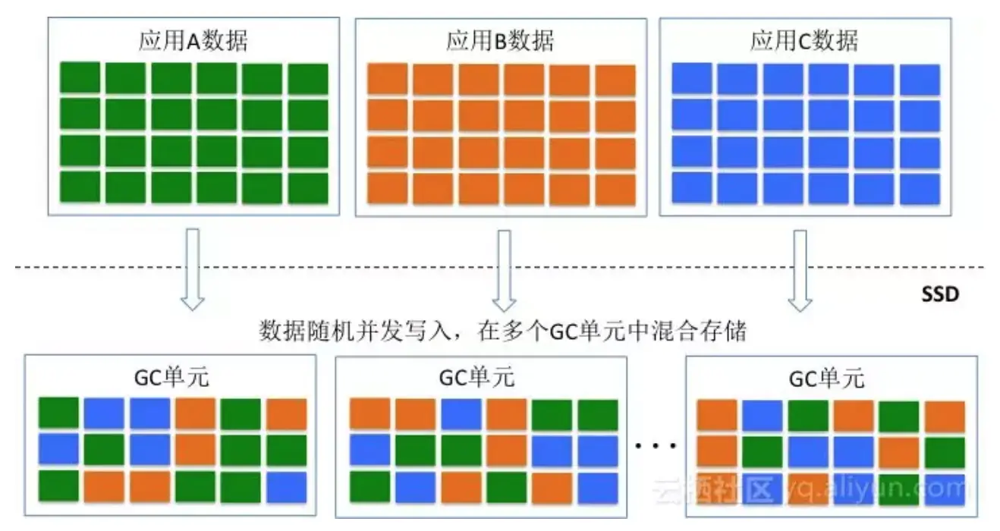
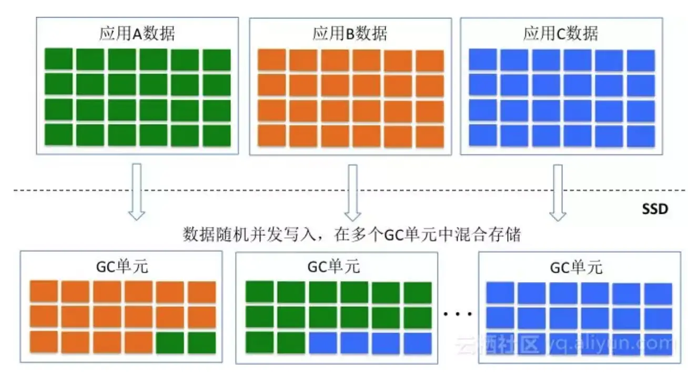
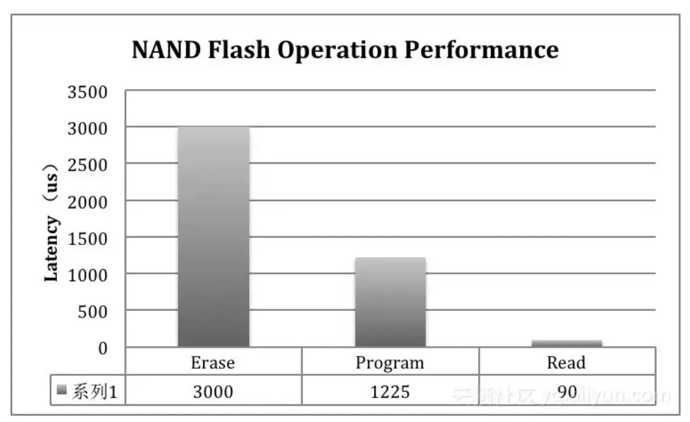
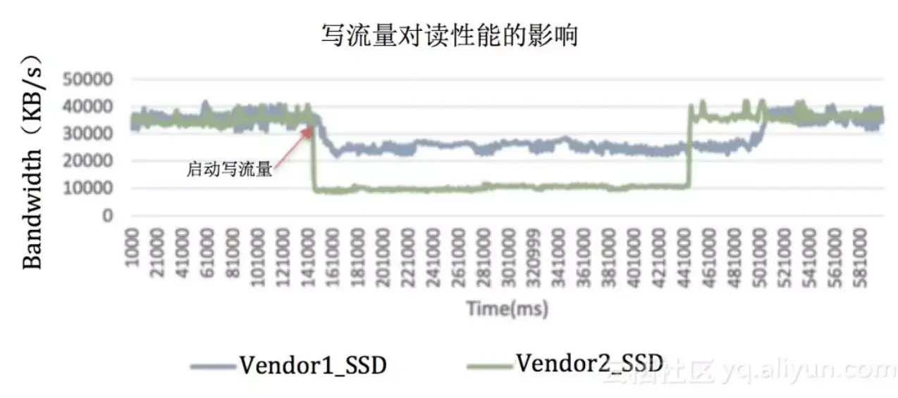
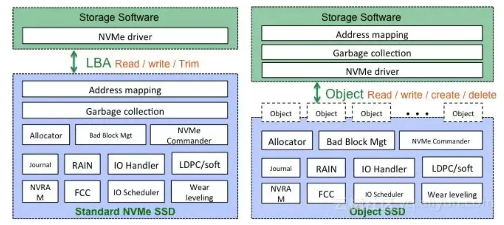
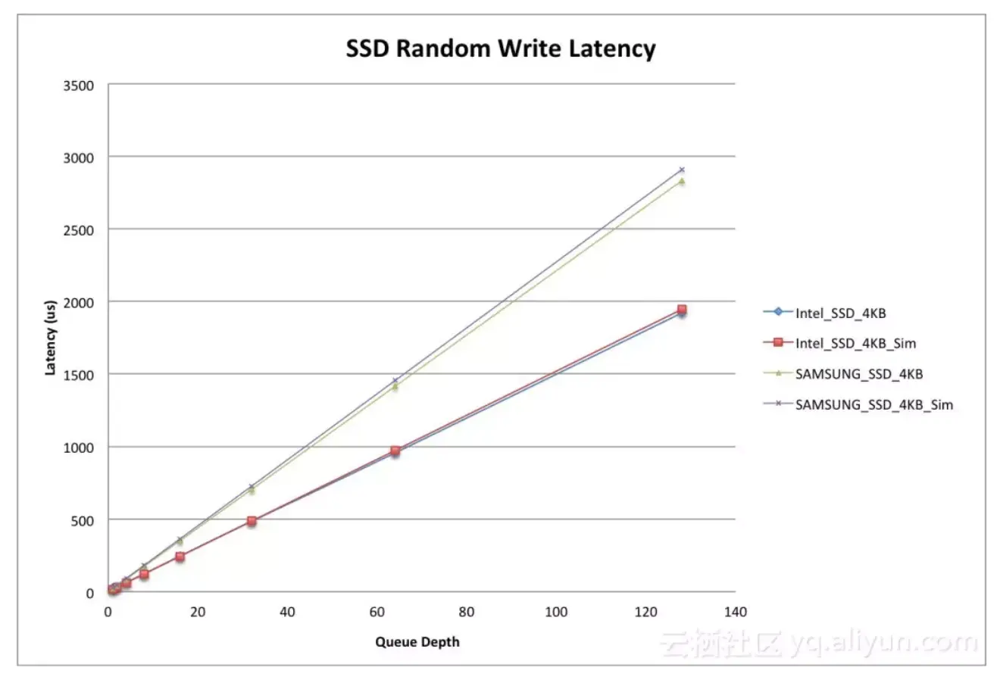

# 优化思路

- [1. 混合介质](#1-混合介质)
- [2. IO Pattern对性能的影响](#2-io-pattern对性能的影响)
  - [2.1. 顺序写入Pattern对SSD性能优化的奥秘](#21-顺序写入pattern对ssd性能优化的奥秘)
  - [2.2. 读写冲突Pattern对性能的影响](#22-读写冲突pattern对性能的影响)
- [3. SSD写性能分析模型](#3-ssd写性能分析模型)
- [4. TDDO](#4-tddo)

## 1. 混合介质

## 2. IO Pattern对性能的影响

IO Pattern会对SSD的性能产生严重影响，主要表现在如下几个方面：
1，    **不同的IO Pattern会产生不同的写放大系数，不同的写放大系数占用后端NAND Flash带宽不同**。当前端应用对SSD采用**完全顺序的方式**进行写入时，此时是最佳的IO Pattern，对于SSD而言写放大系数接近1，SSD内部的背景流量基本可以忽略，前端性能达到最佳。在实际应用中，很难采用这种完全顺序的数据写模型，但可以通过优化逼近顺序写入。
2，    **不同请求大小的IO之间会产生干扰**；读写请求之间会产生干扰。小请求会受到大请求的干扰，从而导致小请求的延迟增加，这个比较容易理解，在HDD上同样会存在这种情况。由于NAND Flash介质存在严重的读写不对称性，因此读写请求之间也会互相干扰，尤其是写请求对读请求产生严重的性能影响。

### 2.1. 顺序写入Pattern对SSD性能优化的奥秘

<https://mp.weixin.qq.com/s/enknWPXgzJldhsneQMQYFQ>

SSD内部采用log-structured的数据记录模式，**并发写入的IO数据按照时间顺序汇聚成大数据块，合并形成的大数据块以Page stripe的方式写入NAND Flash**。多个Page stripe会被写入同一个GC单元（Chunk or Superblock），当一个GC单元被写完成之后，该GC单元进入sealed模式（只读），分配新的GC单元写新的数据。在这种模式下，**如果多个业务的数据流并发随机的往SSD中写入数据，那么多个应用的数据就会交错在一起被存储到同一个GC单元中**。如下图所示，不同应用的数据生命周期不同，当需要回收一个GC单元的时候，会存在大量数据的迁移，这些迁移的数据就会形成写放大，影响性能和使用寿命。

不同应用的数据交错存储在同一个GC单元，本质上就是不同冷热程度的数据交错存储的问题。从GC的角度来讲，相同冷热程度的数据存储在同一个GC单元上是最佳的，为此三星推出了Multi-stream SSD，该SSD就允许不同应用的数据存储到不同的Stream单元（GC单元），从而提升GC效率，降低写放大。Multi-stream是一种显式的设计方式，需要更改SSD接口以及应用程序。**从IO Pattern的角度考虑，可以通过顺序大块的方式也可以逼近类似的效果**。假设操作SSD只存在一个线程，不同的应用都采用大数据块的方式写入数据，那么在一个时间片段内只存在一个应用的数据往SSD中写入数据，那么在一个GC单元内存储的数据会变得有序和规则。如下图所示，采用上述方法之后，一个GC单元内存储的数据将会变得冷热均匀。在GC过程中会大大减少数据的搬移，从而减少背景流量。

在实际应用中，上述IO Pattern很难产生，主要是应用很难产生非常大粒度的请求。**为此在存储系统设计过程中，可以引入Optane高性能存储介质作为SSD的写缓存。前端不同业务的写请求首先写到Optane持久化介质中，在Optane持久化介质中聚合形成大数据块**。一旦聚合形成大数据块之后，再写入SSD，通过这种方式可以最大程度的逼近SSD顺序写入过程，提升SSD的性能和使用寿命。

(牛逼)应用到我们的系统，就是可以把相同epoch的旧版本数据写到同一个块，这样可以一起回收。

### 2.2. 读写冲突Pattern对性能的影响

如下图所示，NAND Flash介质具有很强的读写不对称性。Block Erase和Page Program的延迟会远远高于Page Read所耗费的时间。那么在这种情况下，**如果read请求在同一个Flash Channel上和Erase、Program操作冲突，那么read操作将会被Erase／program操作影响**。这是在读写混合情况下，读性能会受到影响的重要因素。

在实际应用过程中，经常会发现应用的测试结果和SSD Spec对不上，会比Spec给出的值要来的低。**Spec给出的值通常为纯读或者纯写情况下的性能指标，在读写混合的场景下，性能表现和Spec给出的值就会存在非常大的出入**。

对于不同的SSD，通过测试可以发现在读写混合情况下的性能表现差距会比较大。在SSD处于稳态条件下，应用随机读的情况下，如果引入一个压力不是很大的顺序写，那么会发现不同SSD的抗干扰能力是不同的。有些SSD在写干扰的情况下，读性能会急剧下降，延迟快速上升，QoS性能得不到保证。下图是两个SSD在相同情况下的测试结果，从结果来看，有些SSD的抗写干扰能力比较强，读性能不会急剧下降。

为什么有些SSD会具备比较强的抗写干扰能力呢？其中的奥秘就在于SSD内部的IO调度器。IO调度器会对write、read 和Erase请求进行调度处理，该调度器算法的不同就会表现出不同的抗干扰能力。目前很多NAND Flash可以支持Program／Erase Suspension的功能，**在IO调度处理的过程中，为了提升读性能，降低读请求延迟，可以采用Suspension命令对Program／Erase命令暂停，对read请求优先调度处理**。

读写冲突是SSD内部影响IO QoS的重要因素。在SSD内部通过IO调度器的优化可以提升SSD性能的QoS能力，但是还是无法与存储软件结合来协同优化QoS。为了达到最佳的SSD性能QoS，需要关注Openchannel技术。**Openchannel其实只是一种软硬件层次划分的方法**，通常来讲，SSD内部的逻辑可以划分为面向NAND资源的物理资源管理层以及面向数据布局的资源映射层。**物理资源管理由于和NAND Flash密切相关，因此可以放到SSD内部**。传统的NVMe SSD需要对外暴露标准的块设备接口，因此需要在SSD内部实现资源映射层。从端至端的角度来看，**资源映射层可以与存储软件层结合起来，为此将资源映射层从SSD内部剥离出来，集成至存储软件层**。一旦资源映射层从SSD内部剥离之后，需要定义一个新的SSD接口，其中的一种接口方式就是Openchannel。

**盘古分布式存储针对SSD QoS问题进行了大量研究，提出了Object SSD的概念，Object SSD也是一种新的SSD接口方式，其采用对象方式对SSD进行读写删操作，每个对象采用Append write操作方式**。这种接口方式可以很好的与分布式存储无缝结合。采用Object SSD之后，SSD内部的大量工作被简化，IO的调度会更加灵活，存储软件与SSD协同配合，达到IO性能的最优化，以及QoS的最大化。

## 3. SSD写性能分析模型

SSD内部的数据流分成两大类，一类为前端用户数据流；另一类为内部背景数据流。前端用户数据流和背景数据流会汇聚成NAND Flash后端流量。当背景数据流不存在时，NAND Flash带宽会被用户数据流全部占据，此时SSD对外表现的性能达到最佳。当SSD具有较大写放大时，会产生很大的背景数据流，背景流会抢占NAND Flash带宽，导致前端用户IO性能降低。为了稳定前端IO性能，在SSD内部的调度器会均衡前端和背景流量，保证前端性能的一致性。背景流量的占比反应了SSD的写放大系数，因此，站在NAND Flash带宽占用的角度可以分析SSD在稳态情况下的性能。

在此，假设写放大系数为WA，顺序写情况下的总带宽数为B，用户写入流量（随机写入流量）为U。那么，由于GC写放大造成的背景流量为：（WA - 1）* U
写放大流量为一读一写，都会占用带宽，因此，总带宽可以描述为：2  (WA - 1)  U + U = B
因此，**可以得到：U = B / (2(WA - 1) + 1) = B / (2  WA - 1)**
上述公式表述了前端用户流量和NAND Flash总带宽、写放大系数之间的关系。

根据Spec，Intel P4500的顺序写带宽为1.9GB/s，按照上述公式，在随机访问模式下的带宽为： 1900 / (2 * 4 - 1) = 270MB/s，IOPS为67K，根据该公式推导的结果和Spec给出的结果相同。

下图是Intel P4500和Samsung PM963随机写延迟和推导公式之间的对比。结果非常吻合。

由此可以推出，**随机写性能由SSD内部后端带宽以及写放大系数来决定**。因此，从存储软件的角度出发，我们可以通过优化IO Pattern的方式减小写放大系数，从而可以提升SSD的随机写性能。
## 4. TDDO

1. 测试物理页大小，随机不同个LBA的写