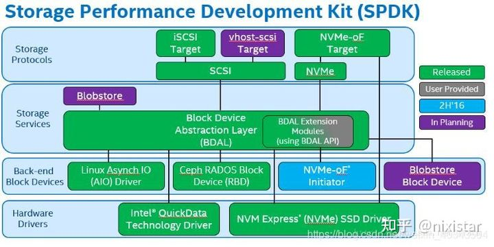

# SPDK 入门

## What

SPDK(Storage Performance Development Kit)存储性能开发套件 —— 针对于支持**nvme协议的SSD设备**。 SPDK是一种高性能的解决方案。

存储性能开发套件 （SPDK） 提供了一组工具和库，用于编写高性能、可扩展的**用户模式**存储应用程序。它通过使用一些关键技术实现高性能：

- 将所有必要的驱动程序移动到用户空间，从而避免 syscalls，并允许从应用程序中访问零拷贝。
- 对硬件进行完成轮询，而不是依赖中断，这降低了总延迟和延迟方差。
- 避免 I/O 路径中的所有锁，而是依靠消息传递。

首先要明确spdk是一个框架，而不是一个分布式系统，spdk的基石（官网用了bedrock 这个词）是**用户态**（user space）、**轮询**（polled-mode）、**异步**（asynchronous）、**无锁**（lockless）的NVMe驱动，其提供了**零拷贝、高并发**直接从用户态访问ssd的特性。其最初的目的是为了优化块存储落盘。但随着spdk的持续演进，大家发现spdk可以优化存储软件栈的各个方面。

很多分布式存储系统都在思考如何吸纳spdk框架，或是采用spdk代表的高性能存储技术，来优化整条IO链路。

## SPDK的设计理念

Intel开发了一套基于nvme-ssd的开发套件，SPDK ，存储性能开发套件。使用了两项关键技术UIO以及polling，spdk主要通过**引入以下技术**，实现其高性能方案。

1. 将存储用到的**驱动转移到用户态**，从而避免系统调用带来的性能损耗，顺便可以**直接使用用态内存落盘实现零拷贝**
2. 使用polling模式
   1. 轮询硬件队列，而不像之前那样使用中断模式，中断模式带来了不稳定的性能和延时的提升
   2. 任何业务都可以在spdk的线程中将轮询函数注册为poller，注册之后该函数会在spdk中周期性的执行，避免了epoll等事件通知机制造成的overhead。
3. 避免在IO链路上使用锁。使用**无锁队列传递消息/IO**
   1. spdk设计的主要目标之一就随着使用硬件（e.g. SSD，NIC，CPU）的增多而获得性能的线性提升，为了达到这目的，spdk的设计者就必须消除使用更多的系统资源带来的overhead，如：更多的线程、进程间通信，访问更多的存储硬件、网卡带来的性能损耗。
   2. 为了降低这种性能开销，spdk引入了无锁队列，使用lock-free编程，从而避免锁带来的性能损耗。
   3. spdk的无锁队列主要依赖的dpdk的实现，其本质是使用cas（compare and swap）实现了多生产者多消费者FIFO队列。

## spdk bdev

spdk在上述加速访问NVMe存储的基础上，提供了块设备（bdev）的软件栈，**这个块设备并不是linux系统中的块设备，spdk中的块设备只是软件抽象出的接口层**。

spdk已经提供了各种bdev，满足不同的后端存储方式、测试需求。如NVMe （NVMe bdev既有NVMe物理盘，也包括NVMeof）、内存（malloc bdev）、不落盘直接返回（null bdev）等等。用户也可以自定义自己的bdev，一个很常见的使用spdk的方式是，用户定义自己的bdev，用以访问自己的分布式存储集群。

**spdk通过bdev接口层，统一了块设备的调用方法**，使用者只要调用不同的rpc将不同的块设备加到spdk进程中，就可以使用各种bdev，而不用修改代码。并且用户增加自己的bdev也很简单，这极大的拓展了spdk的适用场景。

## 架构

SPDK的存储架构分为四层：驱动层、块设备层、存储服务层、存储协议层

### 驱动层

- NVMe driver：SPDK的基础组件，高度优化且无锁的驱动提供了前所未有的高扩展性，高效性和高性能
- IOAT:基于Xeon处理器平台上的copy offload引擎。通过提供用户空间访问，减少了DMA数据移动的阈值，允许对小尺寸I/O或NTB(非透明桥)做更好地利用。

### 块设备层

- Linux AIO：spdk与内核设备（如机械硬盘）交互。
- RBD:将rbd设备作为spdk的后端存储。
- NVMe over Fabrics（NVMe-oF）initiator：本地SPDK NVMe驱动和NVMe-oF initiator共享一套公共的API。本地远程API调用及其简便。 
- Blobstore Block Device：基于SPDK技术设计的Blobstore块设备，应用于虚机或数据库场景。由于spdk的无锁机制，将享有更好的性能。

### 存储服务层

- bdev：通用的块设备抽象。连接到各种不同设备驱动和块设备的存储协议，类似于文件系统的VFS。在块层提供灵活的API用于额外的用户功能（磁盘阵列，压缩，去冗等）。 
- Blobstore：SPDK实现一个高精简的类文件的语义（非POSIX）。这可为数据库，容器，虚拟机或其他不依赖于大部分POSIX文件系统功能集（比如用户访问控制）的工作负载提供高性能支撑。

### 存储协议层

- iSCSI target：现在大多使用原生iscsi
- NVMe-oF target：实现了新的NVMe-oF规范。虽然这取决于RDMA硬件，NVMe-oF target可以为每个CPU核提供高达40Gbps的流量。 
- vhost-scsi target：KVM/QEMU的功能利用了SPDK NVMe驱动，使得访客虚拟机访问存储设备时延更低，使得I/O密集型工作负载的整体CPU负载有所下降。

## SPDK 一些细节

spdk希望通过在用户态直接访问NVMe SSD，而不经过kernel nvme 驱动（bypass kernel）。

spdk将NVMe SSD从内核驱动解绑，再绑定到vfio或者uio驱动上。虽然这两个驱动本身不会对nvme设备做任何初始化操作。但它给了SPDK直接访问nvme设备的能力，后续的初始化和命令下发都由spdk负责。所以spdk访问NVMe SSD的调用基本上都是和nvme命令对应的，如admin cmd spdk_nvme_ctrlr_cmd_set_feature、spdk_nvme_ctrlr_cmd_get_log_page，和io cmd spdk_nvme_ctrlr_alloc_io_qpair、spdk_nvme_ns_cmd_read等等。当然，iouring的sq和cq已经和这里nvme的交互方式比较相似了:)

**通俗的来讲spdk运行时会占用满指定的CPU core，其本质就是一个大的while死循环**，占满一个cpu core。去连续的跑用户指定的poller，轮询队列、网络接口等等。因此，spdk编程最基本的准则，就是**避免在spdk核上出现进程上下文切换**。其会打破spdk高性能框架，造成性能降低甚至不能工作。

进程上下文切换会因为很多原因导致，大致列举如下，我们在spdk编程时切忌要避免。笔者就曾遇到因为spdk线程中一个不起眼的系统调用mmap进入了内核，导致整个spdk进程不可服务直到宕机。

- cpu时间片耗尽
- 进程在系统资源不足（比如内存不足）时，要等到资源满足后才可以- 运行，这个时候进程也会被挂起，并由系统调度其他进程运行。
- 进程主动调用sleep等函数让出cpu使用权。
- 当有优先级更高的进程运行时，为了保证高优先级进程的运行，当前- 进程会被挂起，由高优先级进程来运行。
- 硬件中断会导致CPU上的进程被挂起，转而执行内核的中断服务程序。

## 参考

1. SPDK入门(知乎)：<https://zhuanlan.zhihu.com/p/388959241>
