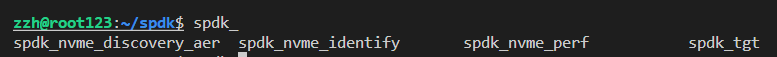

# SPDK实践

<https://github.com/spdk/spdk>
Getting Start：<https://spdk.io/doc/getting_started.html>

## 编译安装

Ubuntu为例

1. 获取源码

```cpp
git clone https://github.com/spdk/spdk
cd spdk
git submodule update --init
```

2. 安装依赖

```cpp
./scripts/pkgdep.sh
```

3. 编译

```cpp
./configure
make
```

4. 单元测试

```cpp
./test/unit/unittest.sh
```

运行单元测试时您会看到一些错误消息，但它们是测试套件的一部分。脚本末尾的最后一条消息指示成功或失败。

5. 安装

```cpp
sudo make install
```

> 由于缺乏版本控制语义，不推荐直接将库安装到系统范围，而是通过参数指定 `-L/path/to/static/libs` 如： `-L/home/zzh/spdk/build/lib`

卸载

```cpp
sudo make uninstall
```

6. 运行性能测试

安装后，会出现`spdk_nvme_perf`工具



查看pci PA地址：

```shell
lspci$ lspci | grep memory
01:00.0 Non-Volatile memory controller: Samsung Electronics Co Ltd Device a80a
81:00.0 Non-Volatile memory controller: Intel Corporation Optane SSD 900P Series
```

可以看到其中一个nvme SSD的地址为81:00.0。

在运行 SPDK 应用程序之前，必须分配一些巨型页面，并且必须从本机内核驱动程序中取消绑定任何 NVMe 和 I/OAT 设备。SPDK 包含一个脚本，用于在 Linux 和 FreeBSD 上自动执行此过程。此脚本应以 root 用户身份运行。

```shell
sudo HUGEMEM=8192 scripts/setup.sh
```

解绑设备，同时设置大页为8192MB。

运行测试：

```shell
$ sudo spdk_nvme_perf -o 4096 -w write -q 1024 -b 0000:81:00.0 -t 10
EAL: No available 1048576 kB hugepages reported
TELEMETRY: No legacy callbacks, legacy socket not created
Initializing NVMe Controllers
Attached to NVMe Controller at 0000:81:00.0 [8086:2700]
Associating PCIE (0000:81:00.0) NSID 1 with lcore 0
Initialization complete. Launching workers.
========================================================
                                                                           Latency(us)
Device Information                     :       IOPS      MiB/s    Average        min        max
PCIE (0000:81:00.0) NSID 1 from core  0:  493964.40    1929.55    2073.08    1013.79    2915.54
========================================================
Total                                  :  493964.40    1929.55    2073.08    1013.79    2915.54
```

其实不指定-b也行，工具会自动寻找设备地址，进行测试。上面测试：写负载，每次写4kb，队列深度为1024，测试时间10s。

测试中发现队列深度有助于吞吐量，但会增加时延。

## 其他使用应用/脚本

```shell
lspci | grep memory
ll /sys/block/nvme*
ll /sys/block/ | grep nvme

sudo ./scripts/setup.sh reset # 将解绑的pci设备，归还操作系统内核
sudo HUGEMEM=8192 scripts/setup.sh #解绑并设置大页
sudo spdk_nvme_identify # 打印系统上可用的nvme设备
sudo spdk_nvme_perf -o 4096 -w write -q 1024 -b 0000:81:00.0 -t 10 # 测试
```

更多spdk_nvme_perf测试命令：<https://spdk.io/doc/nvme.html>

```shell
sudo ./build/examples/perf -q 128 -o 4096 -w randread -r 'trtype:PCIe traddr:0000:81:00.0' -t 5
```
